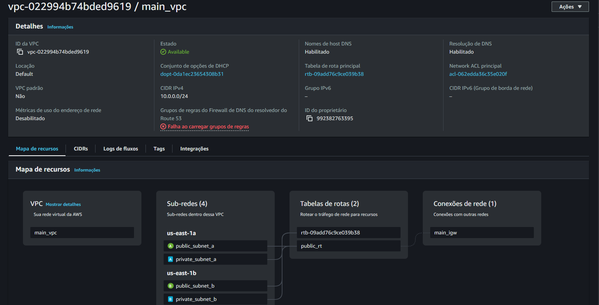
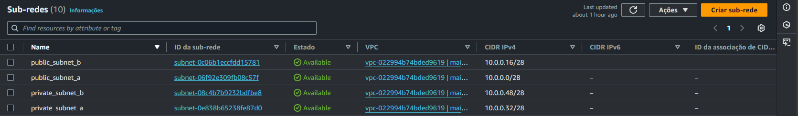
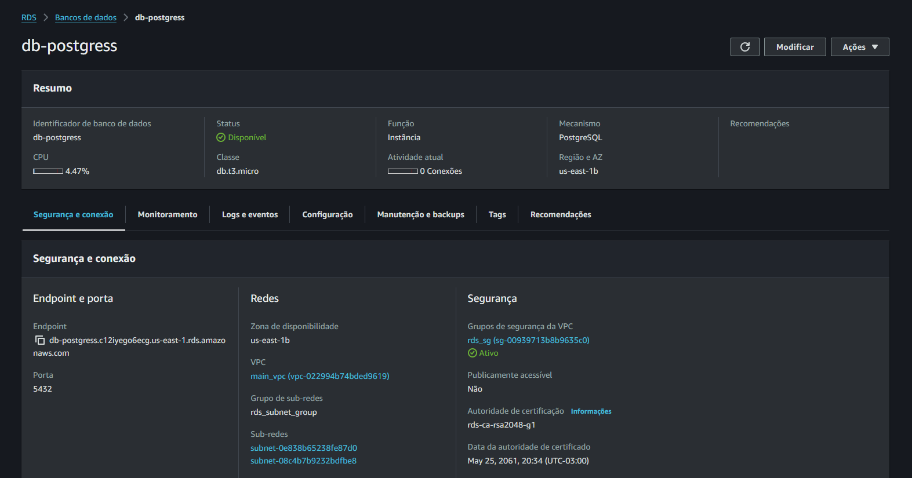
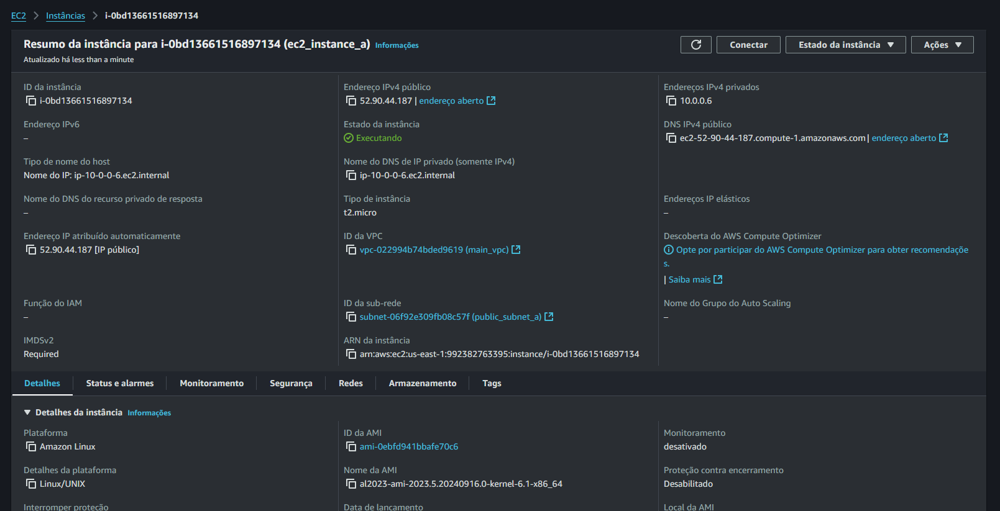
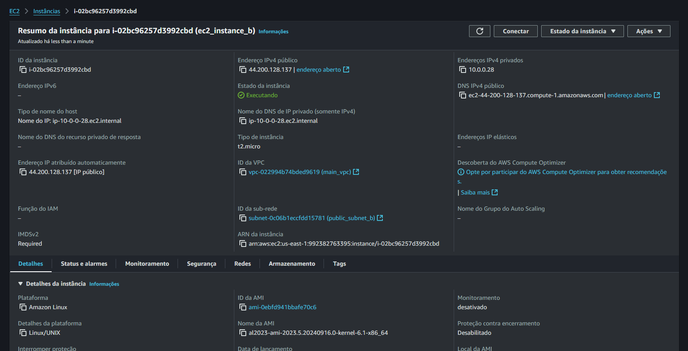
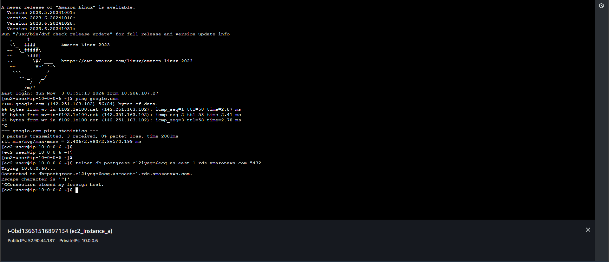

# Projeto Terraform AWS

Este projeto utiliza Terraform para provisionar uma infraestrutura AWS, incluindo uma VPC, duas subnets públicas, duas subnets privadas, um RDS PostgreSQL, duas instâncias EC2 e grupos de segurança para RDS e EC2.

## Estrutura do Projeto

- `main.tf`: Define o provedor AWS e cria a VPC, sub-redes, gateway de internet, tabelas de roteamento, grupos de segurança, instâncias RDS e EC2.
- `outputs.tf`: Define as saídas para os IDs da VPC, sub-redes e instâncias.
- `variables.tf`: Define as variáveis necessárias para o provisionamento, como credenciais e região.

## Recursos Provisionados

- **VPC**: Uma VPC com suporte a DNS e hostnames DNS habilitados.
- **Sub-redes**: Sub-redes públicas e privadas em diferentes zonas de disponibilidade.
  - Sub-rede pública A: `10.0.0.0/28`
  - Sub-rede pública B: `10.0.0.16/28`
  - Sub-rede privada A: `10.0.0.32/28`
  - Sub-rede privada B: `10.0.0.48/28`
- **Gateway de Internet**: Um gateway de internet para acesso público das sub-redes públicas.
- **Tabelas de Roteamento**: Tabela de roteamento para as sub-redes públicas.
- **Grupos de Segurança**: 
  - Grupo de segurança para o RDS permitindo tráfego na porta 5432.
  - Grupo de segurança para EC2 permitindo tráfego na porta 22.
- **RDS PostgreSQL**: Uma instância de banco de dados PostgreSQL.
- **Instâncias EC2**: Duas instâncias EC2 (A e B).

## Provisionamento

```bash
terraform init
terraform plan
terraform apply
```

## Resultado

*todas os ambientes e configurações a seguir já foram permanentemente excluídos











